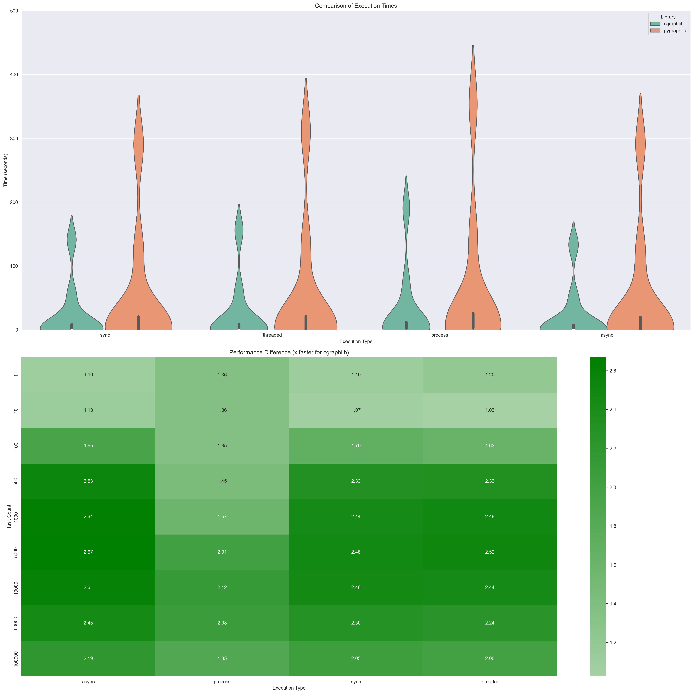

# CGraphLib

## Introduction

A optional dependency written for Syncra is [cgraphlib](https://github.com/alexanderepstein/syncra/blob/mainline/src/cgraphlib/cgraphlib.c). This is a C extension for Python that provides a more efficient implementation of the internal toplogical graph sorter. This is the default implementation for Syncra when the cgraphlib optional dependency is installed.

The extension was inspired by [graphlib](https://docs.python.org/3/library/graphlib.html). The other advantage is that coupled with the fact that syncra has no dependencies it is possible to still use syncra on versions of python that don't support graphlib.

## Benchmark

To benchmark the performance of Syncra, we will be using the [benchmark.py](https://github.com/alexanderepstein/syncra/blob/mainline/benchmark/benchmark.py) script by calling [benchmark.sh](https://github.com/alexanderepstein/syncra/blob/mainline/benchmark/benchmark.sh). This script will create a random DAG with a specified number of tasks and dependencies, and then execute the DAG using Syncra and a few other popular libraries.

--8<-- "benchmark_results.html"

